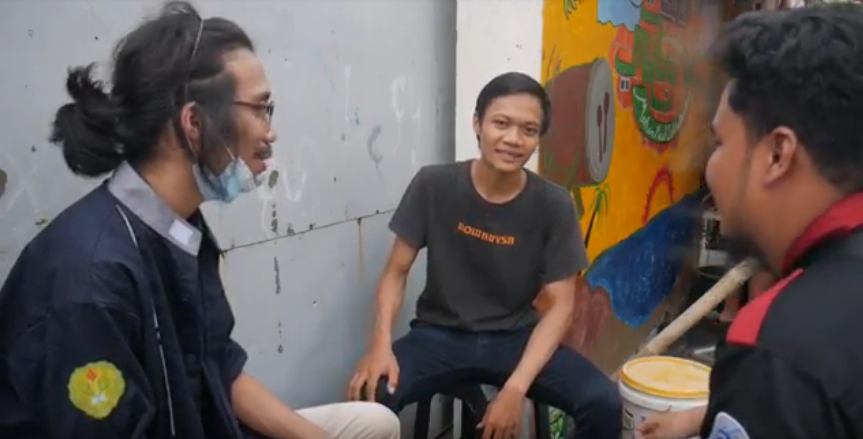
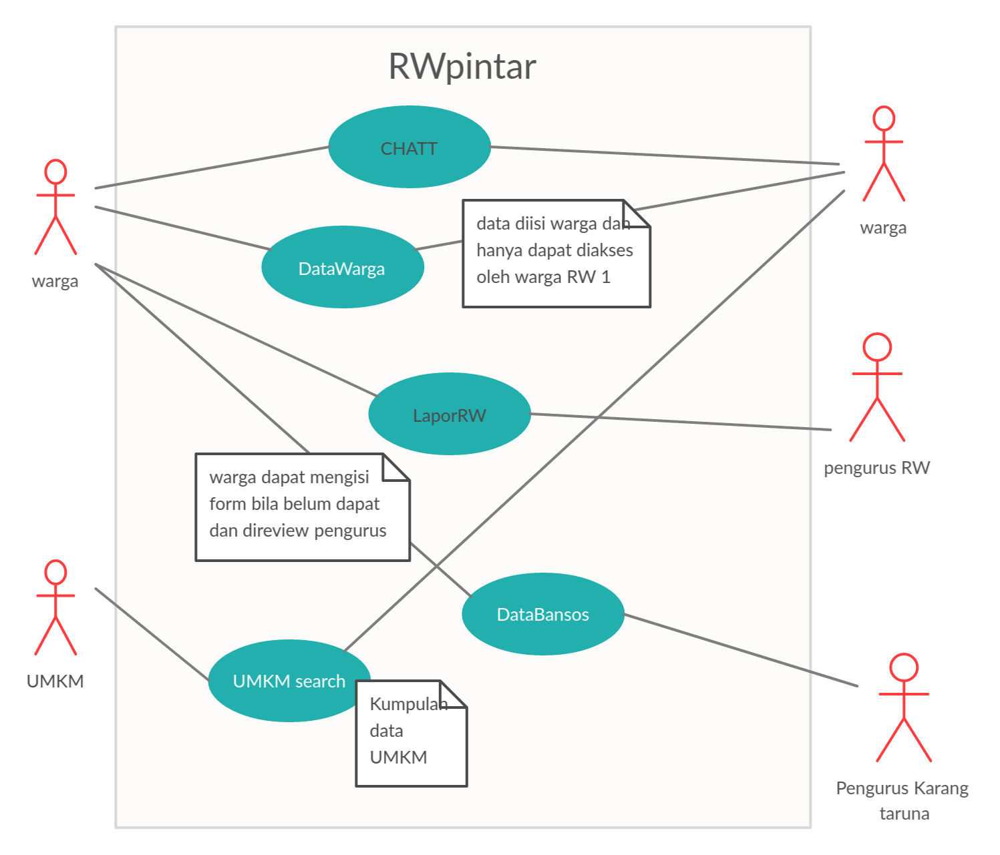
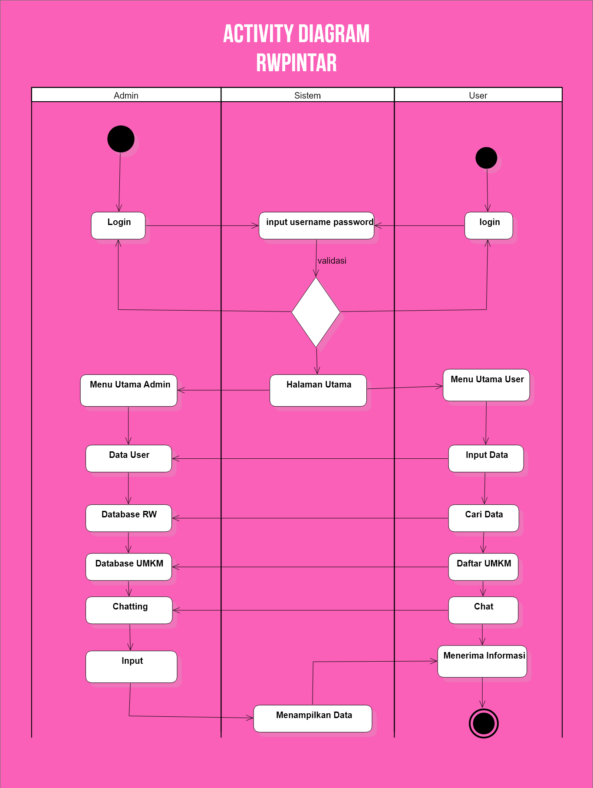

# RWpintar #

It's already almost 1 year after the start of coronavirus outbreak.
one of the problem arise from this outbreak is related to reduced social interaction between people in communities, especially in the
neighborhood of RW (Rukun warga) where social interaction between people and citizen association is important to keep communities running.

So as one of the solution to this problem our teams decided to created an web app for citizen association and people in small neighborhood communities to
interact and managed the neighborhood by online means. 
Our project aim is to help citizen association digitalized their database, social help system and almost all of their communities facilities

## Observation and Interview Result ##
kami melakukan observasi di RW 1, Kelurahan Kebon Kelapa, Kecamatan Gambir, Jakarta pusat. Pada observasi kali ini kami mewawancarai 8 narasumber termasuk
pengurus RW dan Pengurus Karang Taruna di lingkungan RW 1 Kebon Kelapa

> here's our mini report about this Interview
> [report](https://github.com/HCIteamB/RWpintar/blob/main/firstphase.md)

### Narasumber ###
- Narasumber 1 Efendi Audi (wakil ketua Karang Taruna RW 1)
- Narasumber 2 Rudi (Warga sekitar)
- Narasumber 3 Fai  (warga sekitar)
- Narasumber 4 Alif (pengurus Karang Taruna RW 1)
- Narasumber 5 Imam (Penjual Minuman)

### Hasil wawancara ###
- **Pertanyaan 1** : Menurut anda, perlukah diadakan kumpulan data (database) warga secara online di RW ini dan apa pula keuntungannya?
  - Narsum 1: Iya diperlukan, karena nanti bentuk databasenya kan online jadi lebih mudah untuk diakses.   
  - Narsum 2: Bagus kalau diadakan database, jadinya kedata semua warganya. Lebih gampang aja buat ngedatanya jika online.
  - Narsum 3: Kalau menurut saya itu bagus dan menguntungkan juga buat yang lain. Kalo anak jaman sekarang biasanya kalo digital itu paling game, belum tau keuntungan lainnya. Dan juga lebih efisien, karena kan jadi online gitu
  - Narsum 4: Kalau digital sudah jelas lebih mudah.
  - Narsum 5: Kalau dari saya tuh menguntungkan banget.

- **Pertanyaan 2** : Adakah keluhan terkait bantuan sosial di masa pandemi ini ?
  - Narsum 1:Terkait keluhan itu banyak, dan banyak diantara warga yang tidak mau melapor, mungkin karena ribet atau bagaimana.
  - Narsum 2: Pasti ada masalah sih, ga mungkin tidak ada masalah. Dengan adanya data juga lebih mudah untuk bisa dilihat siapa – siapa aja yang udah dapet dan siapa yang belum.
  - Narsum 3,4,dan 5: Banyak yang masalah, seperti bulan ini dapet bansos, bulan depannya malah tidak. Dan juga bansos yang diterima di daerah sini itu kan datanya dari pihak atas, tidak kebagian untuk seluruh warga. Jadinya, pinter – pinter RT-nya aja, digilir untuk bansosnya, sekarang siapa yang dapet, besok siapa yang dapet. Tapi, kembali lagi banyak aja orang yang tidak terima, kemarin dapet bansos sekarang tidak.

- **Pertanyaan 3** : Seberapa berperan aktif  RW di masa pandemi?
  - Narsum 1: Kalo buat pribadi sih masih lumayan, tapi kalau untuk keseluruhan rada kurang. Soalnya RW punya kesibukan sendiri
  - Narsum 2: Peran sih aktif, tapi namanya pandemi begini kalau buat acara atau aktif layaknya normal juga rada susah.
  - Narsum 3,4, dan 5: Untuk kegiatan sosial itu ada bansos, tapi pas awal – awal ada penyemprotan desinfektan juga. Untuk peran lainnya itu cukup kerasa, lebih deket dan mengayomi.

- **Pertanyaan 4** : Apa pelayanan RW yang sekiranya dapat digitalisasi ?
  - Narsum 1: Mungkin terkait surat menyurat, seperti pengantar, dll. Jadi tidak ribet kalau misalkan online.
  - Narsum 2: Dengan adanya website itu akan lebih enak. Kita bisa berbagi keluh kesah kesana dari tiap – tiap warga, bisa diskusi juga di situ.
  - Narsum 3 dan 4: belum ada sih.
  - Narsum 5: Lebih ke pembelajaran dulu, terus para pedagang seperti saya. Karena di masa pandemi pasti semua orang ngeluh gitu. Gimana supaya dagangan kita itu bisa laku dan ke ekspos lebih luas.

--------------

> Check our Interview's Video [here](https://drive.google.com/drive/folders/18MugDFfeybF6qRyJQPVzrbrhlQfc4QRe?usp=sharing)

## Use Case Diagram ##

## Key Activity Diagram ##

### Screenshot of our web app ###

## Our Features ##
- [ ] manajemen RW
- [ ] Database Center
- [ ] LaporRW
- [ ] Chatt warga
- [ ] Eksplorasi RW
- [ ] UMKM Search
- [ ] Data Bansos

## Planned Features ##
- [ ] Digitalisasi Dokumen
- [ ] Forum Jual Beli (marketplace UMKM)
- [ ] Panic Button
- [ ] Mobile UI / Mobile Apps

## 2nd phase of Data Gathering ##
> here's our video on 2nd phase data gathering [video](https://drive.google.com/drive/folders/18MugDFfeybF6qRyJQPVzrbrhlQfc4QRe)

## final report ##
[our final report](https://github.com/HCIteamB/RWpintar/blob/main/final-report.pdf)

### visits our page ###
- [RWpintar](https://hciteamb.github.io/)

## Our teams ##
 Muhammad Daffa Haryadi Putra
- [GeminorumB](https://github.com/GeminorumB) \\ 1313619034
- Muhammad Ridho Rizqillah 
- [Renespeare](https://github.com/Renespeare) \\ 1313619033
- Muhammad Hafidz Hisbullah
- [DragonFly378](https://github.com/DragonFly378) \\ 1313619019

